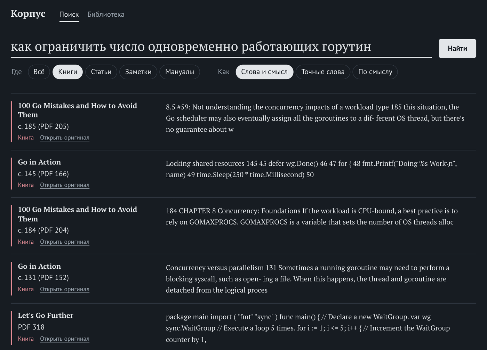
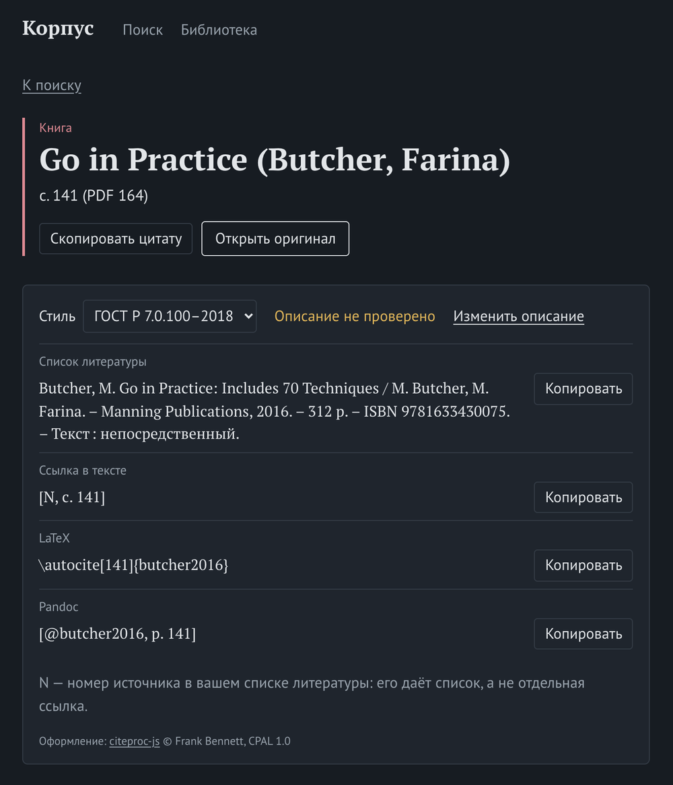

# corpus

Full-text search over the PDF library and reference manuals in `~/.corpus/data`,
the Obsidian vault
and reference manuals such as scikit-learn and NLTK. Exposed as an MCP server and as plain HTTP.



The unit of a hit is a **citable location** — a page for a book, a heading path
for a note — because the point is to quote a source in a note, not to learn that
some book mentions the word. Book pages are cited by the number *printed on the
page*, which is what a reader of any copy can follow; the PDF page follows in
brackets when the two differ, since that is what opens this particular file.
The locator is composed on the way out, from the heading, the page and the
printed number — storing the rendered string once meant re-extracting every book
to change how a citation looks, which happened twice before it was fixed.
Where the printed number cannot be read the locator says `PDF 256` rather than
passing a PDF page off as a page of the book — 40 of the 52 books here have
readable numbering, and the rest are papers and slides that print none.

Granularity is split on purpose: the text index answers per page, while the
vector sees a window that carries ~500 characters of the neighbouring pages.
Two thirds of the pages in this corpus end mid-sentence, so a page on its own is
routinely half a thought — Manning's *Introduction to Information Retrieval*
(printed p. 22) puts it as a precision/recall tradeoff and argues that a system
should offer choices of granularity rather than pick one.

**One chunk, one thought — not "smaller is better".** Cutting long note sections
into parts lifted vector MRR from 0.459 to 0.478, because a section often argued
six things under one heading. Applying the same to book pages was measured too,
and it lost: hybrid found@10 fell from 74% to 68% across the judged set. A page
is already one thought — the author laid it out that way — and half a page is
half an argument. So book pages stay whole and note sections are cut at 1600
characters, and those are the defaults in code, with the numbers beside them.
The splitter counted bytes until it was measured again, which cut a Russian
section at half an English one; see [search evaluation](docs/search-evaluation.md).

## Run

Needs Docker with Compose, and [ollama](https://ollama.com) running on the host
with the model pulled (`ollama pull bge-m3`). It is built and used on macOS,
where a containerised ollama cannot reach the GPU; elsewhere, point
`--ollama` at wherever ollama runs.

Optional: `rerank=1` on a search has a cross-encoder reorder the first 20
candidates, which needs `llama-server` from llama.cpp running on the host with
a reranker model — see [architecture](docs/architecture.md#reranking). Without
it such a search answers unreranked and says so.

```sh
cp .env.example .env   # VAULT_DIR, if you keep notes in Obsidian; the library defaults to ~/.corpus/data
docker compose up -d --build
docker compose logs -f indexer
```

**Keep it on 127.0.0.1.** There is no login: anyone who can reach the ports
can read everything indexed and add to the library. Compose publishes them on
127.0.0.1 only, and both servers refuse requests addressed to any other host
name, which is what stops other web sites open in the browser from reaching
them. See [architecture](docs/architecture.md).

The library is one directory, `LIBRARY_DIR` (by default `~/.corpus/data`):
`books/` for PDFs, `papers/` for [publications](docs/publications.md) and
`manuals/` for [reference manuals](docs/manuals.md).
Uploads from the UI land there too, and so do the bibliographic descriptions
(`bibliography/`), so it is the one place to back up besides the vault, which
stays wherever Obsidian keeps it. Everything in the database is rebuilt from
these two.

The vault is optional. Without `VAULT_DIR` notes are read from `vault/` in the
library, which starts empty, and search covers books, papers and manuals alone.

The indexer re-scans every 15 minutes and skips files whose SHA-256 is unchanged,
so the vault stays current while obsidian-git commits into it.

Contents pages, subject indexes and near-empty dividers are dropped too: they
match any query that names a term the book covers — which is every query — and
answer none. A book with no text layer — a scan, or a PDF whose fonts map to no
Unicode — is recognised with Tesseract instead (see
[architecture](docs/architecture.md#scanned-books)); an empty note is dropped
rather than kept as a row nothing can ever return. Templater sources under `99 - templates/` are code, not knowledge, and
are not walked. Re-parsing
them each pass costs nothing — there is no text to pull, so poppler returns in
milliseconds — and the drop is reported only when it actually removes something.

## Search

In the browser: <http://localhost:8081/> (the originals it opens — PDFs and
manual pages — come from <http://localhost:8082/>, a separate origin on
purpose) — search, read the passage behind a
hit and copy its citation, open the book's PDF at the page, the manual's
original section or the note in Obsidian at its heading, and add books and
manuals on the library page. It works offline; see [working offline](docs/offline.md).



From a shell:

```sh
curl -s 'http://localhost:8080/search?q=агрегат+DDD&kind=book&limit=5' | jq
```

As an MCP server:

```sh
claude mcp add --transport http corpus http://localhost:8080/mcp
```

`kind` is `book`, `paper` ([publications](docs/publications.md)), `vault`,
`docs` (reference manuals), or empty for all. `mode` picks the retrieval method:

| mode               | finds                         | good for                        |
| ------------------ | ----------------------------- | ------------------------------- |
| `fts`              | the words you typed, stemmed  | exact terms, names, quotes      |
| `vector`           | passages about the same thing | a topic you cannot name exactly |
| `hybrid` (default) | both lists fused by rank      | most questions                  |

The `fts` query goes through `websearch_to_tsquery`, so `"точная фраза"` and
`-исключение` work — and it joins your words with AND, so a question phrased as a
sentence usually returns nothing while its one real term returns plenty.

**Full-text search does not cross languages.** Each chunk is stemmed with the
Postgres configuration for its own language, and a Russian query is stemmed as
Russian: it can never match an English page, because stemming is not translation.
Half this corpus is English, so that is half the library invisible to `fts` for a
Russian question. The vector leg is what bridges it — "как ограничить число
одновременно работающих горутин" returns nothing in `fts` and Go in Practice
p. 63 in `vector`. This is why `hybrid` is the default. `per_source=N` keeps one book or note from filling the page
with N+1 paragraphs of the same chapter; it is off by default, because the
question "where is this discussed" and the question "does a note about this
already exist" want different answers. `GET /compare?q=…` runs all three and returns them side by
side.

## Adding to the library

```sh
curl -F file=@book.pdf 'http://localhost:8080/upload?kind=book'
curl -F file=@paper.pdf 'http://localhost:8080/upload?kind=paper'
curl -F file=@site.zip 'http://localhost:8080/upload?kind=docs&manual=nltk'
curl -s 'http://localhost:8080/sources?kind=book' | jq
```

A PDF is saved to `uploads/` in the books or the papers directory, a ZIP of a
manual's built HTML is unpacked into the manuals directory, and the indexer
starts on it at once.
`/sources` lists every source with how many of its chunks are stored, embedded
and quarantined; `kind` and `prefix` narrow it. Uploads are limited to 300 MB
(`mcpd --upload-max`).

## Naming books

A citation shows the source's title, and a title comes from the filename, so the
filenames in the library are the names. Rename freely: a source is matched by the
hash of its contents, so a renamed file is recognised as the book it already was
and keeps its chunks and their embeddings — renaming costs nothing.

Where a filename is opaque — `1476.pdf`, `ТЧА.pdf` — the title is recognised from
the document instead: PDF metadata first, then the cover page, with the obvious
traps rejected (authoring-tool artifacts, the author line, letter-spaced series
headings, mojibake from a mis-decoded font). That is right about three times in
four, which is why it never overrules a filename that already reads as a title.
The remaining quarter is fixed by renaming the file.

## Documentation

- [Architecture](docs/architecture.md) — embeddings, Postgres, containers, design notes
- [Publications](docs/publications.md) — papers, and the list of works each one cites
- [Search evaluation](docs/search-evaluation.md) — the judged set and what it decided
- [Model benchmark](docs/model-benchmark.md) — how the embedding and language models for fully local operation are to be chosen
- [Reference manuals](docs/manuals.md) — indexing scikit-learn, NLTK and other Sphinx sites
- [Citing sources](docs/citing.md) — descriptions, ГОСТ/APA/IEEE, BibLaTeX and Pandoc export
- [Working offline](docs/offline.md) — what to do before a flight
- [Development](docs/development.md) — pre-commit checks, lint, races

## License

MIT — see [LICENSE](LICENSE). Citation styles, locales and the packages the
build installs have licenses of their own: [THIRD_PARTY_NOTICES](THIRD_PARTY_NOTICES.md).
